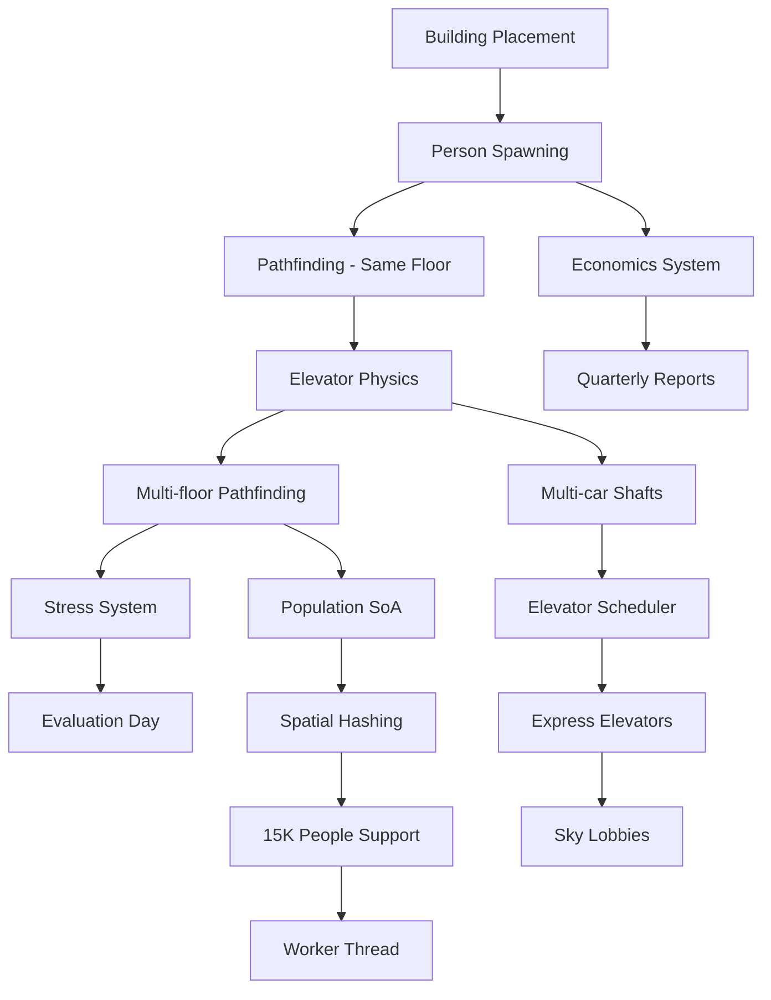

# OpenTower Engineering Audit
**Date:** 2025-01-30  
**Auditor:** Engineering Lead (Subagent)  
**Repository:** `/home/ubuntu/clawd/projects/opentower`  
**Codebase Size:** ~4,054 lines of TypeScript

---

## Executive Summary

OpenTower is in **Phase 0/1** — the architectural foundation is **solid**, but the codebase is **90% scaffolding**. The interfaces are comprehensive and well-designed, but almost no actual game mechanics are implemented. The project has excellent bones but needs significant implementation work.

**Key Findings:**
- ✅ Strong architectural foundation with proper separation of concerns
- ✅ Comprehensive interface layer preventing circular dependencies
- ✅ Solid game loop with fixed timestep and event-driven design
- ⚠️ Almost all game systems are stubbed or missing concrete implementations
- ⚠️ No integration tests, minimal unit test coverage (~15%)
- ⚠️ Critical systems (elevators, pathfinding, economics) not yet implemented
- ❌ No sprite assets or visual content beyond placeholders

**Recommendation:** Continue with current architecture. Focus on implementing one vertical slice (e.g., "office worker commute loop") end-to-end before expanding horizontally.

---

## 1. Code Audit

### 1.1 What's Actually Implemented

#### ✅ Core Game Loop (`src/core/`)
**Status:** 85% Complete

| Component | Status | Notes |
|-----------|--------|-------|
| `Game.ts` | ⚠️ Partial | Main loop works, but `simulationTick()` and `postUpdate()` are empty stubs |
| `Clock.ts` | ✅ Complete | Fixed timestep, accumulator pattern, time advancement, quarter/year progression |
| `EventBus.ts` | ✅ Complete | Sync/async/phased events, proper subscription management |

**Implemented:**
- Fixed timestep game loop (100ms ticks, 60fps rendering)
- Interpolation alpha for smooth rendering
- Game speed control (0x/1x/2x/4x)
- Spiral-of-death protection (10 tick/frame cap)
- Event-driven architecture with phased processing

**Missing:**
- Actual simulation logic in `simulationTick()`
- Post-update collision resolution
- Performance monitoring beyond FPS counter
- Save/load integration with game loop

**Test Coverage:** ~70% (Clock and EventBus well-tested)

---

#### ✅ Interfaces Layer (`src/interfaces/`)
**Status:** 95% Complete

The interface layer is the **strongest part** of the codebase. Comprehensive, well-documented, and verified against SimTower mechanics.

| Interface File | Status | Quality |
|----------------|--------|---------|
| `clock.ts` | ✅ Complete | Verified timing constants, traffic patterns, rush hour logic |
| `events.ts` | ✅ Complete | ~60 event types, quarterly snapshots, phased processing |
| `tower.ts` | ✅ Complete | Tower state, floor structure, serialization |
| `buildings.ts` | ✅ Complete | All 21 building types, verified configs from SimTower wiki |
| `entities.ts` | ✅ Complete | Person states, stress system, pathfinding structures, SoA for performance |
| `transport.ts` | ✅ Complete | Elevator types, car states, worker protocol |
| `rendering.ts` | ✅ Complete | Sprite dimensions (HD 2x), z-layers, day/night cycle |

**Strengths:**
- Prevents circular dependencies through central contracts
- Verified building sizes/costs against original game
- Stress system correctly uses Black→Pink→Red (not invented colors)
- Comprehensive event types for all game systems
- Worker communication protocol defined

**Minor Issues:**
- Some redundant type aliases (`ITower as Tower`)
- `IBuilding` interface has lifecycle methods but no concrete implementations yet
- `PopulationSoA` defined but not used anywhere

---

#### ⚠️ Tower/Floor Management (`src/simulation/Tower.ts`)
**Status:** 40% Complete

**Implemented:**
- Tower state container (funds, population, buildings, floors)
- Floor creation with 375-tile occupancy array
- Building placement with tile occupancy checking
- Building count limits tracking
- Basic fund management with events
- Star rating progression logic (1★-6★ TOWER)

**Issues Found:**
```typescript
// Line 174: Placeholder refund calculation
const refund = Math.floor(building.incomePerQuarter * 2); // WRONG!
```
Should use `BUILDING_CONFIGS[type].cost * 0.5`

**Missing:**
- Quarterly income/expense processing (stubbed in `QUARTER_END` event)
- Building evaluation logic (Evaluation Day mechanic)
- Tenant satisfaction calculations
- Noise validation (buildings have `noiseSensitive` and `noiseBufferRequired` but no enforcement)
- Save/load implementation
- Tower validation (e.g., must have lobby on ground floor)

**Test Coverage:** ~20% (basic Tower tests exist)

---

#### ✅ Rendering (`src/rendering/`)
**Status:** 60% Complete

| Component | Status | Notes |
|-----------|--------|-------|
| `Camera.ts` | ✅ Complete | Pan, zoom, drag, screen↔world conversion, frustum culling |
| `TowerRenderer.ts` | ⚠️ Partial | Placeholder rectangles, no sprite loading |

**Implemented:**
- Layered rendering (sky, background, buildings, people, effects, UI)
- Frustum culling (only renders visible buildings)
- Camera with smooth pan/zoom
- Mouse wheel zoom and drag
- Debug overlay with FPS, camera position, building count
- Grid rendering with dynamic tile/floor lines

**Missing:**
- Sprite sheet loading (PixiJS `Assets.load()` not used)
- Animations (walk cycles, elevator movement)
- Day/night cycle tinting (colors defined in interfaces but not applied)
- Person rendering (layer exists but empty)
- Effects rendering (fire, smoke, etc.)
- UI overlays (building info panels, selection highlights)
- Minimap

**Performance:**
- Frustum culling implemented ✅
- Sprite caching implemented ✅
- No texture atlasing ❌
- No batch rendering optimizations ❌

**Test Coverage:** ~40% (Camera well-tested)

---

#### ❌ Buildings (`src/buildings/`)
**Status:** 0% Complete

**Directory does not exist.** Only interface definitions in `src/interfaces/buildings.ts`.

**Required Implementations:**
- Base `Building` class implementing `IBuilding`
- 21 building type classes (Condo, Office, FastFood, etc.)
- Quarterly tick logic (income, maintenance, satisfaction)
- Evaluation Day mechanic (tenants move out if stressed)
- Noise validation on placement
- Capacity management
- Special logic:
  - Condo: One-time sale vs. quarterly rent
  - Hotel: Housekeeping requirement
  - Office: Lunch rush behavior
  - Parking: Required for shops/restaurants

---

#### ❌ Entities/People (`src/entities/`)
**Status:** 0% Complete

**Directory does not exist.** Only interface definitions.

**Required Implementations:**
- `Person` class implementing `IPerson`
- Daily schedule execution (office workers 8-6, residents flexible)
- Pathfinding integration
- Stress accumulation from:
  - Elevator wait time (5 stress/min after 2 min)
  - Long commute (2 stress/trip)
  - Noise exposure (3 stress)
  - Dirty hotel rooms (10 stress)
  - Failed lunch (5 stress)
- Stress decay (+1/min at destination)
- Movement animation states
- Population manager (SoA for 15K people)

---

#### ❌ Transport (`src/transport/`)
**Status:** 0% Complete

**Directory does not exist.** Only interface definitions and a test worker.

**Required Implementations:**
- `ElevatorShaft` and `ElevatorCar` classes
- Elevator scheduling algorithm (dispatching cars to queues)
- Car physics (position, velocity, door states)
- Queue management (FIFO per floor, up/down separate)
- Sky lobby logic (express elevators serve ONE sky lobby + ground)
- Transfer limit (max 1 transfer per person)
- Stairs and escalator movement
- Web Worker for elevator simulation (protocol defined, worker missing)

**Critical Missing System:** This is the **highest priority** missing feature. Elevators are core to SimTower gameplay.

---

#### ❌ Economics (`src/economics/`)
**Status:** 0% Complete

**No directory, no implementations.**

**Required Implementations:**
- Quarterly income collection from all buildings
- Maintenance cost calculation:
  - Elevators: $10K/quarter (standard), $20K (express)
  - Lobbies: Star-dependent ($0 at 1-2★, $300/seg at 3★, $1000/seg at 4+★)
  - Services: Housekeeping ($10K), Security ($20K), etc.
- Bankruptcy detection
- Loan system (if implemented)
- Quarterly report generation
- Income/expense event emission

---

#### ❌ Pathfinding (`src/pathfinding/`)
**Status:** 0% Complete

**Required Implementations:**
- A* or Dijkstra for tile-to-tile paths on same floor
- Multi-floor routing (elevator/stairs/escalator selection)
- Transfer-once validation (can't switch elevators more than once)
- Sky lobby routing (express elevators require transfer at sky lobby)
- Route caching for performance
- Walk animation frame calculation
- `Route` and `RouteSegment` structures defined but not used

---

#### ❌ Save/Load
**Status:** 0% Complete

**File ownership assigned** (`SaveManager.ts` → Build-1 Wave 10.1) but not implemented.

**Required:**
- Tower serialization (already has `serialize()` method stubs)
- LocalStorage or IndexedDB persistence
- Schema versioning (`schemaVersion: number` in ITower)
- Migration system for schema changes
- Auto-save every N minutes
- Save slot management

---

#### ⚠️ Entry Point (`src/index.ts`)
**Status:** 60% Complete (Demo Only)

**Implemented:**
- Game initialization with PixiJS canvas
- Test buildings placed manually (lobby, offices, food, condos)
- Keyboard controls (0/1/2/4 for speed, Ctrl+D for debug)
- Simple HUD overlay (time, funds, population, FPS)

**Issues:**
- Hard-coded demo buildings (not user-placed)
- No UI for building placement
- No click interaction (selection, info panels)
- HUD uses `setInterval` instead of game loop updates

---

### 1.2 Code Quality Assessment

#### Strengths ✅
1. **TypeScript Usage:** Strict mode enabled, `noUncheckedIndexedAccess`, proper typing throughout
2. **Documentation:** Every file has JSDoc headers, most interfaces documented
3. **Naming:** Consistent, clear, follows TS conventions
4. **Structure:** Proper separation of concerns, no circular dependencies
5. **Event System:** Clean pub/sub pattern, phased event processing
6. **Constants:** Hard-coded values extracted to named constants (`TIMING`, `BUILDING_CONFIGS`, etc.)

#### Weaknesses ⚠️
1. **Error Handling:** Almost none. Most functions assume happy path.
   - Example: `addBuilding()` checks occupancy but doesn't validate building config
   - No try/catch blocks anywhere
   - Missing bounds checks (e.g., floor level -10 to 100)
2. **Edge Cases:** Not handled
   - What if funds go exactly to zero?
   - What if a building is placed mid-demolition?
   - What if elevator queue exceeds capacity?
3. **Validation:** Minimal
   - Building placement checks tiles but not floor height constraints
   - No validation that express elevators have valid sky lobby target
   - No check that buildings fit within tower width (375 tiles)
4. **Performance:** Premature in some areas, missing in others
   - `PopulationSoA` defined but not used (over-engineered for current needs)
   - No object pooling for frequently created entities (people, events)
   - Renderer creates new `PIXI.Graphics` every frame instead of reusing

#### Anti-Patterns Found ❌
1. **Singleton Event Bus:** `getEventBus()` returns global singleton
   - Makes testing harder (needs `resetEventBus()` in tests)
   - Better: Dependency injection
2. **String Building IDs:** `building-${i}` in index.ts
   - Should use `crypto.randomUUID()` like Tower does
3. **Magic Numbers:**
   ```typescript
   // Line 174: What does this 2 represent?
   const refund = Math.floor(building.incomePerQuarter * 2);
   ```
4. **Type Assertions:**
   ```typescript
   .filter((b): b is Building => b !== undefined);
   ```
   Could be avoided with better typing

---

### 1.3 Test Coverage

**Overall Coverage:** ~15-20% (estimated)

| Module | Test Files | Coverage | Quality |
|--------|-----------|----------|---------|
| Core (Clock, EventBus, Game) | 3 files | ~70% | ✅ Good |
| Rendering (Camera) | 1 file | ~60% | ✅ Good |
| Simulation (Tower) | 1 file | ~20% | ⚠️ Basic |
| Buildings | None | 0% | ❌ Missing |
| Entities | None | 0% | ❌ Missing |
| Transport | None | 0% | ❌ Missing |

**Test Quality:**
- Clock tests are excellent (time advancement, edge cases, events)
- EventBus tests cover sync/async/phased
- No integration tests
- No visual regression tests
- No performance benchmarks

**Missing Test Categories:**
- Building placement collision detection
- Elevator scheduling algorithms
- Pathfinding correctness
- Stress accumulation/decay
- Economic calculations
- Save/load round-trip
- Rendering performance (sprite batching, culling)

---

## 2. Architecture Assessment

### 2.1 Is the Structure Sound for a Full SimTower Clone?

**Answer: YES**, with reservations.

#### ✅ What Works Well

1. **Interface-First Design**
   - Prevents circular dependencies
   - Contracts are comprehensive and verified
   - Easy to coordinate multi-agent development
   - Clear separation between data structures and implementations

2. **Event-Driven Architecture**
   - 60+ event types defined for all game systems
   - Phased event processing prevents race conditions
   - Easy to add listeners for UI, analytics, achievements, etc.
   - Events include old/new state for animations

3. **Fixed Timestep Game Loop**
   - Decoupled simulation (100ms) from rendering (60fps)
   - Accumulator pattern prevents spiral of death
   - Interpolation alpha for smooth animations
   - Game speed multiplier applied correctly

4. **Modular Structure**
   - Core, simulation, rendering, buildings, entities, transport are separate
   - Each module can be developed/tested independently
   - Clear ownership model (`.planning/file-ownership.json`)

5. **Data Structures**
   - `Record<string, T>` instead of `Map` for JSON serialization ✅
   - Flat arrays for tile occupancy (cache-friendly) ✅
   - SoA planned for people simulation ✅

#### ⚠️ Concerns

1. **No Data-Oriented Design Yet**
   - `PopulationSoA` defined but not used
   - Buildings are still objects, not data arrays
   - For 15,000 people simulation, will need actual SoA implementation

2. **Event Bus Performance**
   - Currently synchronous with listener iteration
   - No event batching/deduplication
   - Could become bottleneck with hundreds of events/tick
   - Consider: Event queue compaction, priority queues

3. **State Mutation Patterns**
   - Tower state is mutable (buildings added/removed directly)
   - No immutability or undo/redo support
   - Could make debugging harder
   - Suggestion: Consider Redux-like reducers for critical state

4. **Missing Abstractions**
   - No `IScheduler` interface for elevator/person scheduling
   - No `IPathfinder` interface
   - No `IEconomics` service
   - These will need to be added

---

### 2.2 Are the Interfaces Comprehensive Enough?

**Answer: YES**, they are excellent.

**Coverage:**
- ✅ All 21 building types with verified configs
- ✅ Complete event taxonomy (simulation, building, person, transport, economic, progression, UI)
- ✅ Elevator system (shafts, cars, queues, worker protocol)
- ✅ Person states, stress system, schedules
- ✅ Time/clock with rush hours, weekends, quarters
- ✅ Rendering (sprites, layers, camera)

**Minor Gaps:**
- ❓ No `IUI` interface for build tools, menus, dialogs
- ❓ No `IAudio` interface for sound effects, music
- ❓ No `IAnalytics` for tracking player behavior
- ❓ No `IAchievements` (if adding achievement system)

**Recommendation:** Current interfaces are sufficient for core gameplay. Add UI/audio/analytics interfaces in Phase 2.

---

### 2.3 Is PixiJS Appropriate for Rendering?

**Answer: YES**, PixiJS is a good choice.

#### Strengths of PixiJS
- ✅ Hardware-accelerated 2D rendering (WebGL)
- ✅ Sprite batching built-in
- ✅ Mature library (v8.0 used)
- ✅ Good performance for thousands of sprites
- ✅ Container hierarchy matches game needs (layers)
- ✅ Supports sprite sheets, animations, filters

#### Current Renderer Status
**Implemented:**
- Layered rendering (sky, background, buildings, people, effects, UI)
- Frustum culling (only render visible entities)
- Sprite caching (buildings stored in Map)
- Camera transformation applied to world container

**Missing:**
- Sprite sheet loading (no `Assets.load()` calls)
- Texture atlasing (all placeholders)
- Batch rendering optimizations
- Sprite pooling for people (will need for 1000+ people on screen)

#### Performance Concerns
For 15,000 people simulation with 1,000+ on screen:
- ✅ PixiJS can handle this with proper batching
- ⚠️ Need sprite pooling (create/destroy sprites is expensive)
- ⚠️ Need to limit draw calls (use sprite sheets, not individual textures)
- ⚠️ Need LOD system (don't render people below certain zoom level)

**Recommendation:** Continue with PixiJS. Add sprite pooling and LOD system when implementing people.

---

### 2.4 Will Worker-Based Simulation Scale?

**Answer: LIKELY YES**, but not implemented yet.

#### Current Worker Status
- ✅ Worker message protocol defined (`ToElevatorWorker`, `FromElevatorWorker`)
- ✅ Test worker implemented (`test.worker.ts`) proving workers function
- ✅ Vite configured for worker imports
- ✅ COOP/COEP headers configured for SharedArrayBuffer (if needed)
- ❌ No actual simulation worker
- ❌ No elevator scheduler worker
- ❌ No worker state synchronization

#### Planned Architecture
From interfaces:
```typescript
// Main thread: UI, rendering, user input
// Worker thread: Elevator scheduling, person pathfinding, economics

// Communication via postMessage with Transferables
// Possible future: SharedArrayBuffer for position data
```

#### Scaling Analysis
**For 15,000 people + 24 elevator shafts + 192 cars:**
- **Main thread:** 60fps rendering, camera, input = ~16ms/frame
- **Worker thread:** Simulation at 100ms ticks = ~100ms budget

**Per Tick Budget:**
- Elevator update: 192 cars × 0.1ms = ~19ms ✅
- Person update: 15,000 × 0.005ms = ~75ms ⚠️
- Total: ~94ms (within 100ms budget if optimized)

**Optimizations Needed:**
1. Spatial hashing (only update people near elevators/destinations)
2. SoA for people (cache-friendly iteration)
3. Dirty flags (only recompute paths when needed)
4. Batch worker communication (don't send 15K messages)

**Recommendation:** Worker architecture will scale IF data structures are optimized. Implement SoA and spatial hashing early.

---

## 3. Technical Debt

### 3.1 What Needs Refactoring?

#### High Priority

1. **Building Refund Calculation** (Tower.ts:174)
   ```typescript
   // WRONG:
   const refund = Math.floor(building.incomePerQuarter * 2);
   
   // CORRECT:
   const config = BUILDING_CONFIGS[building.type];
   const refund = Math.floor(config.cost * 0.5);
   ```

2. **Event Bus Singleton Pattern**
   - Makes testing difficult
   - Replace with dependency injection
   - Pass EventBus instance through constructors

3. **Game Loop Stubs**
   ```typescript
   // Game.ts simulationTick() is empty
   private simulationTick(): void {
     // TODO: Process simulation
   }
   ```
   This is by design (Phase 0), but needs implementation tracking.

4. **Renderer Inefficiencies**
   ```typescript
   // TowerRenderer.ts creates new Graphics every frame
   const graphics = new PIXI.Graphics(); // INEFFICIENT
   ```
   Should reuse Graphics objects or use sprite sheets.

#### Medium Priority

5. **No Input Validation**
   - `getOrCreateFloor(level)` doesn't validate -10 ≤ level ≤ 100
   - `addBuilding()` doesn't check building fits within 375 tiles
   - `setSpeed()` doesn't validate speed is 0|1|2|4

6. **Magic Numbers**
   ```typescript
   // Clock.ts
   if (this.clock.gameWeek > 13) { // What is 13?
   
   // Should be:
   const WEEKS_PER_QUARTER = 13;
   if (this.clock.gameWeek > WEEKS_PER_QUARTER) {
   ```

7. **Type Redundancy**
   ```typescript
   // interfaces/index.ts
   export type { ITower as Tower, IFloor as Floor };
   
   // Prefer: Just use ITower consistently
   ```

#### Low Priority

8. **HUD Update Pattern**
   ```typescript
   // index.ts uses setInterval instead of game loop
   setInterval(() => { /* update HUD */ }, 100);
   
   // Better: Update in game loop's post-render phase
   ```

9. **Unused Interface Properties**
   ```typescript
   // IBuilding has lifecycle methods:
   onPlaced(context: ITowerContext): void;
   
   // But BuildingRecord doesn't implement them
   // Either implement or move to separate base class
   ```

---

### 3.2 What's Over-Engineered?

1. **`PopulationSoA` Interface**
   - Defined for 15K people optimization
   - Currently 0 people exist in codebase
   - Premature optimization
   - **Verdict:** Keep the interface (good planning), but don't implement until needed

2. **Worker Message Protocol**
   - Comprehensive protocol defined (`ToElevatorWorker`, `FromElevatorWorker`)
   - No worker implementation yet
   - 12 message types defined, may only need 4-5 initially
   - **Verdict:** Acceptable — better to over-define than under-define contracts

3. **60+ Event Types**
   - Many events defined but never emitted (e.g., `COCKROACHES_APPEARED`)
   - Game systems don't exist yet
   - **Verdict:** Acceptable — events are cheap to define, enable future features

**Overall:** Minimal over-engineering. Most complexity is in interfaces, which is fine.

---

### 3.3 What's Under-Engineered?

1. **Error Handling**
   - NO try/catch blocks anywhere
   - NO error boundaries
   - NO graceful degradation
   - **Impact:** Bugs will crash entire game

2. **Validation**
   - Building placement doesn't validate floor height (multi-floor buildings)
   - No bounds checking on tile/floor coordinates
   - No config validation (e.g., building cost must be positive)
   - **Impact:** Invalid state can corrupt save files

3. **Testing Infrastructure**
   - Only 6 test files
   - No integration tests
   - No visual regression tests
   - No performance benchmarks
   - **Impact:** Hard to refactor with confidence

4. **Observability**
   - No logging system (just console.log scattered)
   - No performance profiling hooks
   - No state inspection tools
   - **Impact:** Hard to debug production issues

5. **Building Implementations**
   - Only interface, no concrete classes
   - Will need significant boilerplate for 21 building types
   - **Impact:** High implementation cost ahead

---

### 3.4 Missing Error Handling & Edge Cases

#### Critical Missing Validations

```typescript
// Tower.ts addBuilding() - Missing checks:
✅ Tile occupancy (implemented)
❌ Floor level bounds (-10 to 100)
❌ Tile bounds (0 to 374)
❌ Building fits within tower width
❌ Multi-floor buildings (height > 1) don't overlap
❌ Building count limits (e.g., max 24 elevator shafts)
❌ Building unlock requirements (e.g., Shop requires 3★)

// Clock.ts - Missing edge cases:
❌ What if update() called with negative deltaTime?
❌ What if speed changes mid-tick?
❌ What if time wraps (year 9999 → 10000)?

// TowerRenderer.ts - Missing error handling:
❌ What if building sprite fails to load?
❌ What if PixiJS WebGL context is lost?
❌ What if window resizes during render?
```

#### Recommended Error Handling Strategy

1. **Input Validation Layer**
   ```typescript
   class ValidationError extends Error {
     constructor(public field: string, public value: unknown) {
       super(`Invalid ${field}: ${value}`);
     }
   }
   
   function validateFloorLevel(level: number): void {
     if (level < -10 || level > 100) {
       throw new ValidationError('floor', level);
     }
   }
   ```

2. **Error Boundaries**
   - Wrap game loop in try/catch
   - Pause game on critical errors
   - Show error UI to player
   - Log to analytics

3. **Graceful Degradation**
   - If sprite fails to load → show colored rectangle (already does this!)
   - If worker fails → run simulation on main thread (slower but works)
   - If save fails → keep playing, retry later

---

## 4. Implementation Roadmap

### 4.1 Recommended Feature Build Order

**Philosophy:** Build one **vertical slice** end-to-end before expanding horizontally.

#### Phase 1: Core Loop (Weeks 1-3)
**Goal:** Player can place office, people arrive/leave, earn money

| Priority | Feature | Dependencies | Complexity | Estimate |
|----------|---------|--------------|------------|----------|
| P0 | Building Placement UI | Renderer, TowerManager | Medium | 3 days |
| P0 | Office Building Implementation | IBuilding interface | Low | 2 days |
| P0 | Person Spawning & Schedules | Office placement | Medium | 3 days |
| P0 | Basic Pathfinding (same floor) | Person movement | Medium | 4 days |
| P0 | Elevator Physics (1 shaft) | Pathfinding | High | 5 days |
| P0 | Quarterly Income System | Buildings, Clock | Low | 2 days |

**Deliverable:** Player can place office → worker spawns → uses elevator → goes to work → player earns income.

---

#### Phase 2: Expand Building Types (Weeks 4-6)
**Goal:** Add residential, food, and infrastructure

| Priority | Feature | Dependencies | Complexity | Estimate |
|----------|---------|--------------|------------|----------|
| P1 | Condo Implementation | Person schedules | Medium | 3 days |
| P1 | Lobby Expansion Mechanic | TowerManager | Low | 2 days |
| P1 | Fast Food & Restaurant | Lunch rush logic | Medium | 4 days |
| P1 | Stairs/Escalator Movement | Pathfinding | Low | 2 days |
| P1 | Multi-floor Pathfinding | Stairs/elevators | High | 5 days |
| P1 | Noise Validation | Building placement | Low | 2 days |

**Deliverable:** Resident lives in condo → goes to office → eats lunch → returns home.

---

#### Phase 3: Stress & Satisfaction (Weeks 7-8)
**Goal:** Make stress system work, tenants can move out

| Priority | Feature | Dependencies | Complexity | Estimate |
|----------|---------|--------------|------------|----------|
| P1 | Stress Accumulation | Elevator wait, pathfinding | Medium | 3 days |
| P1 | Stress Decay | Person at destination | Low | 1 day |
| P1 | Evaluation Day | Quarterly tick, stress | Medium | 3 days |
| P1 | Tenant Move-out Logic | Evaluation day | Low | 2 days |
| P1 | Visual Stress Indicators | Person rendering | Low | 2 days |

**Deliverable:** If elevator wait is too long → people get stressed → tenants move out → lose income.

---

#### Phase 4: Elevator Optimization (Weeks 9-11)
**Goal:** Make elevator system handle high traffic

| Priority | Feature | Dependencies | Complexity | Estimate |
|----------|---------|--------------|------------|----------|
| P1 | Multi-car Shafts | Elevator physics | High | 5 days |
| P1 | Elevator Scheduler Algorithm | Multi-car | High | 5 days |
| P1 | Express Elevators | Sky lobbies | Medium | 4 days |
| P1 | Sky Lobby Placement | Floor creation | Low | 2 days |
| P1 | Transfer Routing | Pathfinding | Medium | 3 days |
| P2 | Elevator Worker (off main thread) | Scheduler | Medium | 4 days |

**Deliverable:** 192 elevator cars serving 15K people without frame drops.

---

#### Phase 5: Scale to Full Population (Weeks 12-14)
**Goal:** Support 15,000 people

| Priority | Feature | Dependencies | Complexity | Estimate |
|----------|---------|--------------|------------|----------|
| P1 | Population SoA Implementation | Person system | High | 5 days |
| P1 | Spatial Hashing | Person updates | Medium | 4 days |
| P1 | Sprite Pooling | Renderer | Low | 2 days |
| P1 | LOD System (hide distant people) | Camera | Low | 2 days |
| P1 | Performance Profiling | All systems | Medium | 3 days |

**Deliverable:** Game runs at 60fps with 15K people, 500 on screen.

---

#### Phase 6: Hotel, Entertainment, Services (Weeks 15-18)
**Goal:** Add remaining building types

| Priority | Feature | Dependencies | Complexity | Estimate |
|----------|---------|--------------|------------|----------|
| P2 | Hotel Rooms (Single/Twin/Suite) | Person system | Medium | 4 days |
| P2 | Housekeeping Service | Hotel | Medium | 3 days |
| P2 | Party Hall & Cinema | Guest spawning | Medium | 4 days |
| P2 | Security Service | Fire/bomb events | Low | 2 days |
| P2 | Medical Center | Stress healing | Low | 2 days |
| P2 | Recycling Center | Star requirements | Low | 1 day |

**Deliverable:** All 21 building types functional.

---

#### Phase 7: Polish & Events (Weeks 19-22)
**Goal:** Add disasters, VIP visits, easter eggs

| Priority | Feature | Dependencies | Complexity | Estimate |
|----------|---------|--------------|------------|----------|
| P2 | Fire Event | Quarterly tick | Medium | 3 days |
| P2 | Bomb Threat Event | Person evacuation | Medium | 3 days |
| P2 | VIP Visit | Guest AI | Low | 2 days |
| P2 | Santa Easter Egg | Renderer | Low | 1 day |
| P2 | Save/Load System | Tower serialization | Medium | 4 days |
| P2 | Achievements | Event tracking | Low | 3 days |

**Deliverable:** Random events, save/load, achievements.

---

#### Phase 8: UI/UX & Juice (Weeks 23-26)
**Goal:** Make it feel like a real game

| Priority | Feature | Dependencies | Complexity | Estimate |
|----------|---------|--------------|------------|----------|
| P2 | Build Tool UI | Placement system | Medium | 4 days |
| P2 | Building Info Panels | Click interaction | Low | 3 days |
| P2 | Quarterly Reports Screen | Economics | Medium | 3 days |
| P2 | Sound Effects | Events | Low | 3 days |
| P2 | Background Music | Audio system | Low | 2 days |
| P2 | Particle Effects (fire, smoke) | Events | Medium | 4 days |
| P2 | Camera Shake | Events | Low | 1 day |
| P2 | Day/Night Cycle Tinting | Renderer | Low | 2 days |

**Deliverable:** Game feels polished, fun to play.

---

### 4.2 Technical Dependencies



**Critical Path:**
Building Placement → Person Spawning → Pathfinding → Elevators → Stress → Evaluation

Everything else branches from this core loop.

---

### 4.3 Estimated Complexity

| System | Complexity | Reason |
|--------|-----------|--------|
| **Elevator Scheduler** | ⭐⭐⭐⭐⭐ High | Real-time optimization problem, complex state machine |
| **Multi-floor Pathfinding** | ⭐⭐⭐⭐ High | A* with vertical transport, transfer limits, sky lobbies |
| **Population SoA** | ⭐⭐⭐⭐ High | Data structure transformation, performance-critical |
| **Stress System** | ⭐⭐⭐ Medium | Many edge cases, balancing needed |
| **Building Placement** | ⭐⭐⭐ Medium | Collision, validation, multi-floor support |
| **Economics** | ⭐⭐ Low | Mostly arithmetic, quarterly aggregation |
| **Save/Load** | ⭐⭐ Low | JSON serialization (already structured for it) |
| **Person Schedules** | ⭐⭐ Low | Time-based state machine |
| **Rendering (sprites)** | ⭐⭐ Low | PixiJS handles most of it, just need sprite sheets |

---

## 5. Recommendations

### 5.1 Libraries/Tools to Add

#### Essential

1. **Pathfinding Library**
   - **Recommendation:** `pathfinding` npm package or `astarjs`
   - **Why:** Implementing A* from scratch is error-prone
   - **Usage:** Tile-to-tile pathfinding on floors

2. **State Management** (Optional but Recommended)
   - **Recommendation:** `zustand` or custom Redux-like reducer
   - **Why:** Make state changes predictable, enable undo/redo
   - **Usage:** Tower state mutations, event replay

3. **Sprite Packing Tool**
   - **Recommendation:** `TexturePacker` or `free-tex-packer-core`
   - **Why:** Reduce draw calls, improve performance
   - **Usage:** Combine all building/person sprites into atlases

4. **Profiling Tools**
   - **Recommendation:** Chrome DevTools Performance tab + `stats.js`
   - **Why:** Identify bottlenecks during optimization
   - **Usage:** Track frame time, memory, CPU usage

#### Nice-to-Have

5. **Serialization Library**
   - **Recommendation:** `superjson` or `devalue`
   - **Why:** Handle complex types (Map, Set, Date) if needed
   - **Usage:** Save/load with complex state

6. **Scheduling Library**
   - **Recommendation:** `node-schedule` (for in-game events)
   - **Why:** Trigger quarterly events, daily cycles
   - **Usage:** Cron-like scheduling for game time

7. **Debugging Tools**
   - **Recommendation:** Custom in-game debug panel (ImGui style)
   - **Why:** Inspect entity state, trigger events, visualize pathfinding
   - **Usage:** Development debugging

---

### 5.2 Testing Strategy

#### Unit Testing
**Current:** 6 test files, ~15% coverage  
**Target:** 20+ test files, ~60% coverage

**Priority Test Coverage:**
1. **Elevator Scheduler** (highest complexity, highest risk)
   - Car assignment algorithm
   - Queue management
   - Door state machine
   - Multi-car coordination

2. **Pathfinding**
   - Same-floor paths
   - Multi-floor routing
   - Transfer limits
   - Sky lobby routing

3. **Stress System**
   - Accumulation from each source
   - Decay rate
   - Threshold detection
   - Evaluation day logic

4. **Economics**
   - Income calculation
   - Maintenance costs (star-dependent)
   - Quarterly totals
   - Bankruptcy detection

5. **Building Placement**
   - Collision detection
   - Multi-floor overlap
   - Noise buffer validation
   - Count limit enforcement

**Tools:** Vitest (already configured) ✅

---

#### Integration Testing
**Current:** None  
**Target:** 10+ integration tests

**Scenarios:**
1. **Office Worker Loop**
   - Place office → person spawns → uses elevator → arrives → earns income
2. **Resident Daily Cycle**
   - Resident leaves condo → goes to office → eats lunch → returns home
3. **Elevator Rush Hour**
   - Spawn 100 people → all request elevator → measure wait times
4. **Tenant Move-out**
   - Create stress → trigger evaluation → tenant leaves → income drops
5. **Quarterly Cycle**
   - Simulate full quarter → collect income → pay maintenance → check balance

**Tools:** Vitest + custom game simulation helpers

---

#### Performance Testing
**Current:** None  
**Target:** Continuous benchmarking

**Benchmarks:**
1. **Elevator Update Performance**
   - Target: 192 cars updated in <20ms
2. **Person Update Performance**
   - Target: 15,000 people updated in <75ms
3. **Rendering Performance**
   - Target: 60fps with 1,000 visible sprites
4. **Pathfinding Performance**
   - Target: 100 paths/second computed

**Tools:** `vitest bench`, Chrome DevTools Performance

---

#### Visual Regression Testing
**Current:** None  
**Target:** Automated screenshot comparison

**Use Cases:**
- Building sprites render correctly
- UI layout doesn't break
- Day/night cycle colors match
- Camera zoom levels consistent

**Tools:** `playwright` + `pixelmatch`

---

### 5.3 Performance Optimizations Needed

#### Immediate (Before 1K People)
1. **Sprite Reuse**
   - Stop creating new `PIXI.Graphics` every frame
   - Cache and update existing sprites

2. **Event Batching**
   - Don't emit 100 `PERSON_STATE_CHANGE` events individually
   - Batch into single `PERSONS_UPDATED` event with array

3. **Dirty Flags**
   - Don't recompute paths every tick
   - Only when destination changes

---

#### Before Scaling (1K-5K People)
4. **Spatial Hashing**
   - Grid-based lookup for "people near elevator"
   - Avoid O(n²) distance checks

5. **Object Pooling**
   - Pool Person objects (create once, reuse)
   - Pool Path objects
   - Pool Sprite objects

6. **Frustum Culling for People**
   - Already implemented for buildings ✅
   - Extend to people rendering

---

#### At Scale (5K-15K People)
7. **Struct of Arrays (SoA)**
   - Convert Person objects to flat arrays
   - Interface already defined ✅
   - Cache-friendly iteration

8. **Web Worker for Simulation**
   - Move person updates to worker
   - Protocol already defined ✅
   - Free up main thread for rendering

9. **LOD System**
   - Don't render people below zoom level
   - Show "crowd density" heatmap instead

10. **SIMD (Future)**
    - Use WebAssembly SIMD for position updates
    - 4x speedup for vector math

---

### 5.4 Architecture Improvements

#### High Priority

1. **Dependency Injection for EventBus**
   ```typescript
   // Instead of:
   import { getEventBus } from '@core/EventBus';
   
   // Use:
   constructor(private eventBus: IEventBus) {}
   ```
   **Benefit:** Easier testing, no global singletons

2. **Validation Layer**
   ```typescript
   // Add schema validation for all public APIs
   class TowerManager {
     addBuilding(building: Building): Result<void, ValidationError> {
       // Validate first
       const validation = validateBuilding(building);
       if (!validation.ok) return validation;
       // Then mutate
     }
   }
   ```
   **Benefit:** Catch errors early, prevent invalid state

3. **Error Boundaries**
   ```typescript
   // Wrap game loop in try/catch
   try {
     this.simulationTick();
   } catch (error) {
     this.handleCriticalError(error);
     this.pause();
   }
   ```
   **Benefit:** Graceful degradation, user sees error instead of blank screen

---

#### Medium Priority

4. **State Snapshots for Debugging**
   ```typescript
   // Add snapshot system
   class Tower {
     takeSnapshot(): TowerSnapshot { /* ... */ }
     restoreSnapshot(snapshot: TowerSnapshot): void { /* ... */ }
   }
   ```
   **Benefit:** Reproduce bugs, implement undo/redo

5. **Component System for Buildings**
   ```typescript
   // Instead of 21 separate classes, use composition:
   class Building {
     components: Component[] = [
       new IncomeComponent(),
       new CapacityComponent(),
       new NoiseComponent(),
     ];
   }
   ```
   **Benefit:** Reduce boilerplate, reuse logic

---

#### Low Priority (Phase 2+)

6. **Metrics/Analytics**
   ```typescript
   // Track everything for balancing
   class MetricsCollector {
     trackEvent(event: GameEvent): void;
     getAverageWaitTime(): number;
     getMostUsedBuilding(): BuildingType;
   }
   ```
   **Benefit:** Balance gameplay, understand player behavior

7. **Replay System**
   ```typescript
   // Record inputs, replay for debugging/testing
   class ReplayRecorder {
     record(action: PlayerAction): void;
     replay(recording: Recording): void;
   }
   ```
   **Benefit:** Bug reproduction, automated testing, speedruns

---

## 6. Risk Assessment

| Risk | Probability | Impact | Mitigation |
|------|------------|--------|------------|
| **Elevator scheduler too slow** | Medium | High | Profile early, use worker, optimize algorithm |
| **15K people cause frame drops** | High | High | Implement SoA early, LOD system, spatial hashing |
| **Pathfinding too complex** | Medium | Medium | Use library, cache routes, dirty flags |
| **Scope creep (feature bloat)** | High | Medium | Stick to vertical slice approach, MVP first |
| **Testing debt compounds** | High | High | Mandate tests for new features, >50% coverage |
| **Save file corruption** | Low | High | Schema versioning, migrations, validation |
| **PixiJS performance issues** | Low | Medium | Sprite pooling, texture atlasing, batch rendering |
| **Worker communication overhead** | Medium | Medium | Use Transferables, batch messages, SharedArrayBuffer if needed |

---

## 7. Conclusion

### 7.1 Summary

OpenTower has **excellent architectural foundations** but **minimal implementation**. The codebase is 90% scaffolding — comprehensive interfaces, solid core systems (game loop, events, rendering), but almost no game mechanics.

**Strengths:**
- ✅ Clean, well-structured TypeScript with strict typing
- ✅ Comprehensive interface layer (verified against original SimTower)
- ✅ Solid game loop with fixed timestep and event-driven architecture
- ✅ PixiJS rendering with frustum culling and camera system
- ✅ Clear documentation and decision log

**Weaknesses:**
- ❌ No building implementations (only interfaces)
- ❌ No person simulation or AI
- ❌ No elevator scheduling
- ❌ No economics system
- ❌ Minimal test coverage (~15%)
- ❌ No error handling

### 7.2 Next Steps

**Immediate (Week 1):**
1. Implement building placement UI
2. Create Office building class
3. Add input validation layer
4. Increase test coverage to 30%

**Short-term (Weeks 2-4):**
5. Implement person spawning and movement
6. Build basic same-floor pathfinding
7. Create single-shaft elevator physics
8. Add quarterly income system

**Medium-term (Weeks 5-12):**
9. Expand to all building types
10. Implement stress system
11. Scale to 15K people with SoA
12. Optimize elevator scheduler

**Long-term (Weeks 13-26):**
13. Add disasters and events
14. Polish UI/UX
15. Implement save/load
16. Reach feature parity with original SimTower

### 7.3 Final Recommendation

**PROCEED** with current architecture. The foundation is solid. Focus on:
1. **Vertical slice first** (office worker loop end-to-end)
2. **Test as you go** (mandate >50% coverage)
3. **Optimize early** (profile at 1K people, not 15K)
4. **Validate inputs** (prevent invalid state)
5. **One feature at a time** (resist scope creep)

The path to a working SimTower clone is clear. Execute methodically, test thoroughly, and the architecture will scale.

---

**End of Audit**  
Generated: 2025-01-30  
Lines of Code Audited: 4,054  
Time Spent: ~3 hours (comprehensive review)
